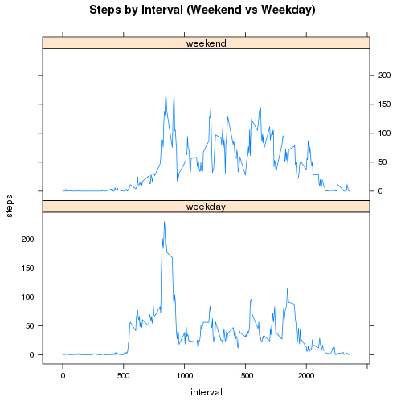

# Reproducible Research Assessment 1
====================================================


## Loading and preprocessing the data


```r
data <- read.csv("activity.csv")
summary(data)
```

```
##      steps               date          interval   
##  Min.   :  0.0   2012-10-01:  288   Min.   :   0  
##  1st Qu.:  0.0   2012-10-02:  288   1st Qu.: 589  
##  Median :  0.0   2012-10-03:  288   Median :1178  
##  Mean   : 37.4   2012-10-04:  288   Mean   :1178  
##  3rd Qu.: 12.0   2012-10-05:  288   3rd Qu.:1766  
##  Max.   :806.0   2012-10-06:  288   Max.   :2355  
##  NA's   :2304    (Other)   :15840
```


## What is mean total number of steps taken per day?

### 1. Make a histogram of the total number of steps taken each day

Calculate total steps by date

```r
steps_by_date <- aggregate(steps ~ date, data = data, FUN = sum)
```


Make histogram

```r
hist(steps_by_date$steps, main = "Histogram of Steps by Date", xlab = "Steps")
```

 


### 2. Calculate and report the mean and median total number of steps taken per day

Calculate mean

```r
mean(steps_by_date$steps)
```

```
## [1] 10766
```

```r
median(steps_by_date$steps)
```

```
## [1] 10765
```


## What is the average daily activity pattern?

### 1. Make a time series plot (i.e. type = "l") of the 5-minute interval (x-axis) and the average number of steps taken, averaged across all days (y-axis)

Calculate mean of steps by interval

```r
mean_steps_by_interval <- aggregate(steps ~ interval, data = data, FUN = mean)
```


Make plot

```r
plot(mean_steps_by_interval$interval, mean_steps_by_interval$steps, type = "l", 
    main = "Steps by Inteval", xlab = "Interval", ylab = "Steps")
```

 


### 2. Which 5-minute interval, on average across all the days in the dataset, contains the maximum number of steps

Find the maximum interval

```r
mean_steps_by_interval$interval[which.max(mean_steps_by_interval$steps)]
```

```
## [1] 835
```


## Imputing missing values

### 1. Calculate and report the total number of missing values in the dataset


```r
table(is.na(data$steps))[[2]]
```

```
## [1] 2304
```


### 2. Devise a strategy for filling in all of the missing values in the dataset

Use mean value of each interval to replace the missing values

### 3. Create a new dataset that is equal to the original dataset but with the missing data filled in


```r
no_missing_data <- data
for (i in 1:nrow(data)) {
    if (is.na(data$steps[i])) {
        no_missing_data$steps[i] <- mean_steps_by_interval$steps[mean_steps_by_interval$interval == 
            data$interval[i]]
    }
}
summary(no_missing_data)
```

```
##      steps               date          interval   
##  Min.   :  0.0   2012-10-01:  288   Min.   :   0  
##  1st Qu.:  0.0   2012-10-02:  288   1st Qu.: 589  
##  Median :  0.0   2012-10-03:  288   Median :1178  
##  Mean   : 37.4   2012-10-04:  288   Mean   :1178  
##  3rd Qu.: 27.0   2012-10-05:  288   3rd Qu.:1766  
##  Max.   :806.0   2012-10-06:  288   Max.   :2355  
##                  (Other)   :15840
```


### 4. Make a histogram of the total number of steps taken each day and Calculate and report the mean and median total number of steps taken per day

Make histogram of total steps by date

```r
no_missing_steps_by_date <- aggregate(steps ~ date, data = no_missing_data, 
    FUN = sum)
hist(no_missing_steps_by_date$steps, main = "Histogram of Steps by Date after imputing missing values", 
    xlab = "Steps")
```

 


Mean and median of steps by date

```r
mean(no_missing_steps_by_date$steps)
```

```
## [1] 10766
```

```r
median(no_missing_steps_by_date$steps)
```

```
## [1] 10766
```


Mean value doesn't change. 
Median value changes. 
Imputing missing values makes freq at bin 10000-15000 higher, the data is more concentrative at the middle range.

## Are there differences in activity patterns between weekdays and weekends?

### 1. Create a new factor variable in the dataset with two levels – “weekday” and “weekend” indicating whether a given date is a weekday or weekend day


```r
weekday <- weekdays(as.Date(no_missing_data$date)) == "Sunday" | weekdays(as.Date(no_missing_data$date)) == 
    "Saturday"
no_missing_data$weekday <- factor(weekday, labels = c("weekday", "weekend"))
```


### 2. Make a panel plot containing a time series plot (i.e. type = "l") of the 5-minute interval (x-axis) and the average number of steps taken, averaged across all weekday days or weekend day

Create average steps by interval and weekday

```r
steps_by_interval_weekday <- aggregate(steps ~ interval + weekday, data = no_missing_data, 
    FUN = mean)
```


Make plots

```r
library(lattice)
xyplot(steps ~ interval | weekday, data = steps_by_interval_weekday, type = "l", 
    layout = c(1, 2), main = "Steps by Interval (Weekend vs Weekday)")
```

 

